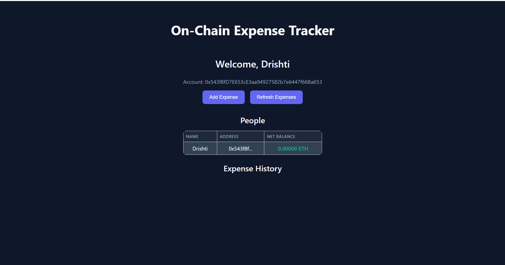

# BlockBase-Project

## ✅ Features Added
- Solidity Feature: `getMyName()` to Get your own name
- JavaScript Feature: Display connected wallet address

## 🔧 Code Fix or Customization
- Implemented the smart contract feature in the `ExpenseTracker (BlockBase.sol)`
- Integrated with frontend in `App.js` using ethers.js

## 🖼️ Screenshot of Working DApp

- Wallet Address: 0x543f8fD7E653cE3aa94927582b7e6447f66Ba653
- Registered Name: Drishti
